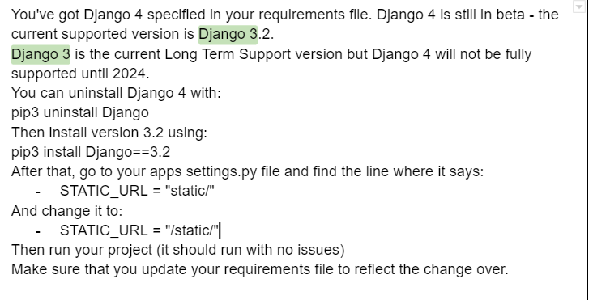
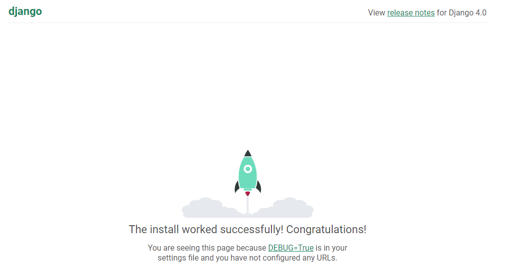
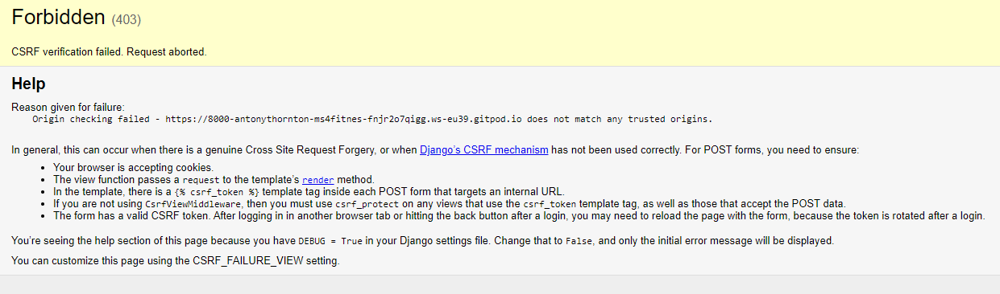

# The Veggie Guy Fitness App
## Introduction
Welcome to my fourth project. This project is a simple online Fitness Subscription Application that allows users to manage their own recipes remotely. This will use languages such as Django, Python, HTML, CSS and JavaScript.

This project will show the use of CRUD functionality (Create, Read, Update, Delete). The user will be able create, read, update and delete their user profile. They will also be able to purchase items from the shop. 

A live website can be found <a href="" target="_blank">here</a>.

# Table of Contents

-   [1. UX](#ux)
    -   [1.1. Strategy](#strategy)
        -   [Project Goals](#project-goals)
            -   [User Goals:](#user-goals)
            -   [User Expectations:](#user-expectations)
    -   [1.2. Structure](#structure)
    -   [1.3. Skeleton](#skeleton)
    -   [1.4. Surface](#surface)
-   [2. Features](#features)
-   [3. Technologies Used](#technologies-used)
-   [4. Testing](#testing)
-   [5. Development Cycle](#development-cycle)
-   [6. Deployment](#deployment)
-   [7. End Product](#end-product)
-   [8. Known Bugs](#known-bugs)
-   [9. Credits](#credits)

# 1.UX
#### [Go To Top](#table-of-contents "Go To Top")
This project is designed to extend "The Veggie Guy" brand by offering a fitness solution alongside a cookbook solution seen <a href="https://cook-book-antony.herokuapp.com/" target="_blank">here</a>. 

The website is primarily built with influence from code insititues mini project which utilises the bootstrap framework. Credit for the UX design is due for both parties. 

 

## 1.1 Strategy
#### [Go To Top](#table-of-contents "Go To Top")

 

## Project Goals
The main goal of this project is to allow the user to 

The website should:
* Promote a brand of fitness recipe's(In this case books) and other fitness related products
* Allow the user to create a profile
* Allow the user to purchase fitness related products

## User Goals:

### First Time Visitor Goals

The user should be able to add items to:
* Add items to their cart
* View their cart
* Adjust items in their cart
* Purchase their items and get them delivered
* Get a visual and email confirmation of their purchase

Returning Visitor Goals
The user should be able to add items to:
* View items in their cart from the last visit if they did not purchase
* Add items to their cart
* View their cart
* Adjust items in their cart
* Purchase their items and get them delivered
* Get a visual and email confirmation of their purchase

### User Expectations:
The system should have a simple user interface, with the navigation to each section clear and concise.

* Each page is clear to read
* The user interface is easy to navigate
* The website is responsive on all devices
* Thr user should be able to browse and purchase products.

## 1.2 Structure
#### [Go To Top](#table-of-contents "Go To Top")

It is really important to include responsive design in this project as many users are using different devices (mobile, tablet, laptop/PC). This gives the user the best experience on their device.

* Responsive on all device sizes
* Easy navigation through labelled buttons
* All elements will be consistent including font size, font family, colour scheme.

## 1.3 Skeleton
#### [Go To Top](#table-of-contents "Go To Top")

## Sitemap

## Wireframes

## 1.4 Surface
#### [Go To Top](#table-of-contents "Go To Top")

### Font and colours:
Colours used can be found <a href="https://getbootstrap.com/docs/5.0/utilities/colors/" target="_blank">here</a>.

Fonts used have been pulled through using Bootstrap 5.

In order to stay consistent with the Veggie Guy brand I have chosen a Green theme. The green is slightly different to the cookbook website due to materialisecss and bootstrap differences but I am happy as this allows the user to differentiate which site they are looking at.

# 2. Features
#### [Go To Top](#table-of-contents "Go To Top")

## Navigation

* The navigation bar has two layouts. One view for a desktop and the other for mobile.

* The desktop view uses a traditional layout utilising materialisecss default navigation. The user should clearly find all navigational pages at the top right.

* As with the desktop view the mobile uses existing CSS code but compresses the links into a collapsible element at the top right. The user should be able to open the element and see all the available links.

## Home Page

* The home page is the main landing page for the site. When the user visits the page, they should be able to understand what the website is about and what it can offer them.
* The page presents information as its primary feature.  

## Features left to implement
* Load the cookbook website into this site - Ideally the cookbook and the fitness app will be on the same site so the user profile can accomodate both and it becomes a community hub.
* Star Rating system

# 3. Technologies Used
#### [Go To Top](#table-of-contents "Go To Top")

* <a href="https://html.com/html5/" target="_blank">HTML 5</a>  
    * The project uses Hypertext Markup Language
* <a href="https://en.wikipedia.org/wiki/CSS" target="_blank">CSS3</a>
    * The project uses Cascading Style Sheets 
* <a href="https://www.javascript.com/" target="_blank">JavaScript</a>
    * The project uses JavaScript
* <a href="https://www.python.org/" target="_blank">Python</a>
    * The project uses Python
* <a href="https://www.djangoproject.com/" target="_blank">Django</a>
    * The project uses Django web frameworks
* <a href="https://materializecss.com/" target="_blank">Materialize</a>
    * The project uses Materialize CSS structuring
* <a href="https://balsamiq.com/wireframes/" target="_blank">Balsamiq Wireframes</a>
    * Balsamiq was used to create the wireframes during the design process
* <a href="https://www.gitpod.io/" target="_blank">Gitpod</a>
    * The project uses Gitpod
* <a href="https://github.com/" target="_blank">GitHub</a>
    * GitHub was used to store the project's code after being pushed from Git
* <a href="https://www.heroku.com/" target="_blank">Heroku</a>
    * The project uses Heroku to host the website
* <a href="https://www.google.co.uk/chrome/" target="_blank">Chrome</a>
    * The project uses Chrome to debug and test the source code using HTML5
* <a href="https://beautifier.io/" target="_blank">Code beautifier</a>
    * Corrects JavaScript/HTML/CSS code with correct spacing/lines etc.
* <a href="https://stripe.com/" target="_blank">Stripe</a>
    * For live and testing payment methods. During development I used a specific set of card details.

#### [Go To Top](#table-of-contents "Go To Top")

# 4. Testing
#### [Go To Top](#table-of-contents "Go To Top")

In order to reduce content in this README full testing has been documented in a seperate README.

See <a href="https://github.com/Antony-Thornton/MS4--Fitness-Subscription-App/blob/main/READMETESTING.md" target="_blank">here</a> for full testing

# 5. Development Cycle
#### [Go To Top](#table-of-contents "Go To Top")

A Code Insititute template can be found <a href="https://github.com/Code-Institute-Org/gitpod-full-template" target="_blank">here</a>.

### Setting up a new repository. 
1. Go to the link above and click use this template
2. Name it as required and select include all branches
3. Click create new repository
4. Click on the green gitpod button
5. Navigate to <a href="https://gitpod.io/workspaces">gitpod workspaces</a> and pin the workspace
6. Use this link to continue working in that environment

### Install Django

Note: I had an issue with versions of django (installed 4 but should have been 3.22) see below for details.
 
1. In the terminal type in "pip3 install Django" May need to specify version here.
2. Once installed type in "django-admin startproject fitness_subscription_app ."
    * change "fitness_subscription_app" to whatever you want to call it
    * This will create all your python files

### .gitignore file
1. Add *.sqlite3
2. Add *.pyc
3. Add __pycache__

### Test the django environment
1. In the terminal type "python3 manage.py runserver"
    * You may need to expose port 8000
    * You should see a message as per below if successfull

### Python Migrations
1. Type into the terminal "python3 manage.py migrate"
    * I believe this migrates your files to the django website

### Create a superuser
1. Type into the terminal "python3 manage.py createsuperuser"
2. Enter desired username
3. Enter desired email
4. enter desired password
5. Confirm password
    * You should get a creation successful message
    

### Install Django Allauth Part 1

See <a href="https://django-allauth.readthedocs.io/en/latest/installation.html" target="_blank">here</a> for details.

1. In the terminal type "pip3 install django-allauth"
2. Add "# Required by allauth" at the end of line 62 for reference
3. Get settings from website link above and copy over "AUTHENTICATION_BACKENDS" code to the settings.py file
4. Under the "INSTALLED_APPS" function of your settings.py file paste in the "Allauth" apps you would like to use
    * For this I used:
    'django.contrib.sites',
    'allauth',
    'allauth.account',
    'allauth.socialaccount',
5. Underneath "AUTHENTICATION_BACKENDS" in your settings.py file add "SITE_ID = 1"
6. Add "path('accounts', include('allauth.urls'))," to your urls.py file
7. Add , include to this line "from django.urls import path" in the url.py file as shown "from django.urls import path, include"

### Python Migrations
1. Type into the terminal "python3 manage.py migrate"
    * I believe this migrates your files to the django website

### Test the django environment
1. In the terminal type "python3 manage.py runserver"
    * You may need to expose port 8000
    * You should see a page not found message
2. In the navigation bar add /admin at the end and log using superuser details
    * I came across an error when logging in

    * To fix this issue

        

3. Change domain Name in the sites section of the admin page (I had a bug here. See known bugs section for details on fix)
    * I went with "fsa.example.com" and "Fitness Subsription App" for this project
4. Log out and quit server

### Install Django Allauth Part 2
1. In urls.py file add / to the end of the path('accounts/') line
2. in settings.py add " EMAIL_BACKEND = 'django.core.mail.backends.console.EmailBackend' " under "SITE_ID"
3. In admin go to emails
4. Add new email (top right)
5. Select Super user Email with serch Icon and update with verified and primary ticked
6. LOGOUT of admin - I didnt do this so thought it wasnt working
7. Go to the url path for the 8000 port like normal then add "/accounts/login" at the end
    * this should take you to a log in page
8. Log in with the details of the user you created
    * If it worked it should redirect to a page with "/success" at the end
9. In the terminal type in "pip3 freeze > requirements.txt"
10. In the terminal type mkfir templates and then mkdir templates/allauth
11. Commit changes to github

### Creating html templates
1. In the terminal type "cp -r ../.pip-modules/lib/python3.8/site-packages/allauth/templates/* ./templates/allauth/"
    * To check python version type "python --version" in the terminal as it has to match
    * -r means copy everything
2. Delete any templates you dont plan to change
    * For this I deleted; "OpenID" and "tests"
3. Add a base.html file under the "/templates/allauth" folder path
4. In the base.html file you can either create your own or copy in a template
    * For this I will be using <a href="https://getbootstrap.com/docs/5.1/getting-started/introduction/">Bootstrap5 </a>
5. Add another meta tag - < meta http-equiv="X-UA-Compatible" content="ie=edge" >
    * This will support older internet explorer windows
6. Move the scripts to the top header
7. Add "" to the very top of the page 
8. Block off sections for extra functionality

### Creating and linking html pages
In the terminal you need to create the app for the page

1. Type "python3 manage.py startapp home" into the terminal
2. Type "mkdir -p home/templates/home"
    * p = parent
3. Richt click on the new template and click new file called "index.html" or "x"
4. In the template add in the extends base.html python code for example

        
        

        
            <h1 class="display-4 text-success">It works!</h1>
        

5. In views.py define the template view under the new template
        from django.shortcuts import render

        # Create your views here.

        def index(request):
        """ A view to return the index page """

        return render(request, 'home/index.html')

6. Copy the project (top level) urls.py code and paste it into the new template folder

        from django.contrib import admin
        from django.urls import path
        from . import views

        urlpatterns = [
        path('', views.index, name='home')
        ]
7. In the urls.py file at project level add the url for the home page
8. In the project level settings.py file add "'home/'," to the installed apps
9. In the same file under TEMPLATES update the DIRS with

            os.path.join(BASE_DIR, 'templates'),
            os.path.join(BASE_DIR, 'templates', 'allauth'),

10. Save changes and test its working by loading a new server
    * When I first did this I had a few files out of place so was getting "ModuleNotFoundError: No module named 'home/'" error

# 6. Deployment
#### [Go To Top](#table-of-contents "Go To Top")

Deployment Notes from course:

If you get the error below during the steps to deployment:
* django.db.utils.OperationalError: FATAL: role "somerandomletters" does not exist

Please run the following command in the terminal to fix it:
unset PGHOSTADDR

A note for creating your database if you didn't use fixtures
When you come to follow this process for your milestone project, you may not have used a fixtures file to populate your database like the instructor did.
If this is the case, manually re-creating your database when you come to deploy can take a considerable amount of time. Thankfully, there is a short process you can follow to download your local mysql database and then upload it to postgres:
1. Make sure your manage.py file is connected to your sqlite3 database
2. Use this command to backup your current database and load it into a db.json file:
./manage.py dumpdata --exclude auth.permission --exclude contenttypes > db.json
3. Connect your manage.py file to your postgres database
4. Then use this command to load your data from the db.json file into postgres:
./manage.py loaddata db.json
If you would like more information on this process along with a few handy tips, have a look at this DevTip on Slack.
Video

### Step 1 - Create a Heroku App
1. Log in to your Heroku Account
2. Click create new app
3. Name it and select closest region
4. Go to resources tab and install the "Heroku Postgres" Add on (Free plan)
5. Go back to Gitpod and install pip3 install dj_database_url and psycopg2-binary
6. Freeze requirements with pip3 freeze > requirements.txt

### Step 2 - Settings
7. Settings.py and import dj_database_url

        import dj_database_url
8. Comment out default databases code

        DATABASES = { 'whatever you have in here in your settings'}

9. Replace with

        DATABASES = {
            'default': dj_databas_url.parse('''''ADD URL HERE''''' See below)
        }
10. Get the url from heroku in the settings tab then Config Vars
11. Run migrations (python3 manage.py showmigrations)
12. Import all product data by running (data in your admin tab) you may need to follow the steps below these lines. I did for this project.:
    * python3 manage.py loaddata categories' In this case
    * python3 manage.py loaddata products' In this case

            A note for creating your database if you didn't use fixtures
            When you come to follow this process for your milestone project, you may not have used a fixtures file to populate your database like the instructor did.
            If this is the case, manually re-creating your database when you come to deploy can take a considerable amount of time. Thankfully, there is a short process you can follow to download your local mysql database and then upload it to postgres:
            1. Make sure your manage.py file is connected to your sqlite3 database
            2. Use this command to backup your current database and load it into a db.json file:
            ./manage.py dumpdata --exclude auth.permission --exclude contenttypes > db.json
            3. Connect your manage.py file to your postgres database
            4. Then use this command to load your data from the db.json file into postgres:
            ./manage.py loaddata db.json
            If you would like more information on this process along with a few handy tips, have a look at this DevTip on Slack.
            Video

13. Create a super user to log in with

### Tentative steps
14. Comment out step 9 and un comment step 8
15. Git push changes

To prevent 500 errors during login on a deployed site you need to make a one line addition to your settings file.

    ACCOUNT_EMAIL_VERIFICATION = 'none'

### Step 3 - Database set up
16. Add an if statement in the settings.py file that selects the database

        if 'DATABASE_URL' in os.environ:
            DATABASES = {
                'default': dj_database_url.parse(os.environ.get('DATABASE_URL'))
            }
        else:
            DATABASES = {
                'default': {
                    'ENGINE': 'django.db.backends.sqlite3',
                    'NAME': os.path.join(BASE_DIR, 'db.sqlite3'),
                }
            }

17. Install gunicorn using the terminal and freeze requirements
18. Create a Procfile in the main area (same as readme) and put

        web:gunicorn fitness_subscription_app.wgsi:application
19. In the terminal write heroku login which should spawn a login message. Look for any instructions in the terminal
    * You may get an error like I did where the popup didnt load. Follow these <a href="https://stackoverflow.com/questions/63363085/ip-address-mismatch-on-signing-into-heroku-cli" target="_blank">steps</a>
        1. Navigate to https://dashboard.heroku.com/account/applications
        2. In Authorizations click on create authorization button
        3. Add description in pop up eg.heroku cli and leave expire after blank if you dont want it to expire
        4. You will get authorization token
        5. in cli run heroku login -i
        6. when it prompts for password enter the authoriation token
20. Login if needed
21. Disable static files being loaded so that Heroku doesnt try when the app is deployed
    
        heroku config:set DISABLE_COLLECTSTATIC=1
22. You may get an error message about a missing flag in the terminal. Run the same line as above but with --app and the app name at the end
        heroku config:set DISABLE_COLLECTSTATIC=1 --app fitness_subscription_app
23. Add host names to allowed hosts in settings.py

        ALLOWED_HOSTS = ['Heroku app path', 'localhost'] (local for gitpod server)
24. Add and commit changes with push
25. Push to heroku using
    * git push heroku main  - Worked for me instead of master see <a href="https://stackoverflow.com/questions/63363085/ip-address-mismatch-on-signing-into-heroku-cli" target="_blank">for</a>
        git push heroku master
    * You may also need to add a runtime.txt file and put your python version number in there. python --version & 
    * You may need to initialize your herokuy git remote if you created your app on the website rather than with the CLI and pu

        heroku git:remote -a 'Heroku app name'

    Then

        git push heroku master

26. A url should appear in the teminal which will load your page without the static files (css etc)
27. In Heroku site:
    * Go to the deploy page
    * Connect to github and add repository name you want to connect to and then click connect.
    * Enable automatic deploys on the same page
28. Get a secret key from an online secret key generator
29. In heroku on the settings page add it to config vars as 'SECRET_KEY'
30. In settings.py replace the secret key above DEBUG with

        SECRET_KEY = os.environ.get('SECRET_KEY', '')

31. Change DEBUG to 

        DEBUG = 'DEVELOPMENT' in os.environ
32. Push changes to git hub

### Step 4 - Amazon Web Services

Link for steps 34 on - https://codeinstitute.s3.amazonaws.com/fullstack/AWS%20changes%20sheet.pdf
33. Log into/create an account on aws.amazon.com
34. Under services find s3 and create a bucket
35. Name the bucket so it matches your project and select nearest region
36. Uncheck block all public access and acknowledge it as public
37. Create bucket
38. click on the bucket and go to properties tab
39. turn on static website hosting
40. Update index document with "index.html"
41. Erro document with "error.html"
42. Save
43. Go to permissions tab
44. In the Cross-origin resource sharing (CORS) add in the configiration below. This allows the website to communicate with S3
        CORS configuration

        Important
        AWS updated their systems after this video was made and the code from the video above for the CORS configuration no longer works.

        Please use the following code for your CORS configuration instead:

        [
            {
                "AllowedHeaders": [
                    "Authorization"
                ],
                "AllowedMethods": [
                    "GET"
                ],
                "AllowedOrigins": [
                    "*"
                ],
                "ExposeHeaders": []
            }
        ]

45. Under bucket policy
    * Click policy generator
        * Type = "S3 bucket policy"
        * Principle = *
        * Action = GetObject
        * Amazon Resource Name (ARN) equals the line from the bucket page e.g. "arn:aws:s3:::the-veggie-guy-fitness"
        * Click Add statement
        * Click Generate Policy
        * Copy JSON code that appears
        * Paste into the bucket policy editor field
        * Add a /* at the end of the resource line

                  "Resource": "arn:aws:s3:::the-veggie-guy-fitness/*",
        * Click save
46. Under Access control list (ACL) update Public access to list objects to list
    * I had to update ACL's List to do this.
47. In the services and or search bar look for IAM resources 
48. Create a group by clicking "User Groups" on the left 
    * Name the group
    * Click Create Group as we dont have policies to attach
49. Click  policies on the left
    * Create Policy
    * JSON tab
    * Import Manage Policy
    * Search for s3 and import "AmazonS3FullAccess"
    * Get the bucket policy ARN (Step 45)
    * Replace the * in resource with this

            "Resource": [
                "arn:aws:s3:::the-veggie-guy-fitness",
                "arn:aws:s3:::the-veggie-guy-fitness/*"
            ]
    * Click next and review policy
    * Add a name (app name from heroku with -policy at the end) and description
    * Click create policy
50. Go to groups and click on the earlier created group. 
51. Follow steps from the link noted at the start of step 4
52. Creat a user from the users page
    * Click add users
    * Name it e.g. tvgf-user
    * Give them programmatic access
    * Click next
    * Put the user in the group
    * Click through all the next buttons
    * Download and SAVE THE CSV SOMEWHERE SECURE AS THIS CANNOT BE DONE AGAIN

### Step 5 - In Gitpod (connect django to s3)

53. Install "pip3 install boto3" and "pip3 install django-storages"
54. "pip3 freeze > requirements.txt"
55. In settings.py add storages under INSTALLED_APPS =
56. Under static files comment in settings.py add
    * The keys come from the csv you downloaded. DO NOT SHARE WITH ANYONE.
        * Add them to your Heroku Config Vars
        * USE_AWS also goes in there with a value of true

                if 'USE_AWS' in os.environ:
                    AWS_STORAGE_BUCKET_NAME = 'Add bucket name here' i.e. the-veggie-guy-fitness
                    AWS_S3_REGION_NAME = 'Add name here' i.e. EU (London) eu-west-2
                    AWS_ACCESS_KEY_ID = os.environ.get('AWS_ACCESS_KEY_ID')
                    AWS_SECRET_ACCESS_KEY = os.environ.get('AWS_SECRET_ACCESS_KEY')
                    AWS_S3_CUSTOM_DOMAIN = f'{AWS_STORAGE_BUCKET_NAME}.s3.amazonaws.com'

57. In config vars remove the DISABLE_COLLECTSTATIC variable as it is no longer needed
58. Create a new .py file called custom_storages.py in the main section and paste in 

        from django.conf import settings
        from storages.backends.s3boto3 import S3Boto3Storage

        class StaticStorage(S3Boto3Storage):
            location = settings.STATICFILES_LOCATION

        class MediaStorage(S3Boto3Storage):
            location = settings.MEDIAFILES_LOCATION

59. In settings.py
    * Add the below under the if statement

                # Static and media files
                STATICFILES_STORAGE = 'custom_storages.StaticStorage'
                STATICFILES_LOCATION = 'static'
                DEFAULT_FILE_STORAGE = 'custom_storages.MediaStorage'
                MEDIAFILES_LOCATION = 'media'

                # Override static and media URLs in production
                STATIC_URL = f'https://{AWS_S3_CUSTOM_DOMAIN}/{STATICFILES_LOCATION}/'
                MEDIA_URL = f'https://{AWS_S3_CUSTOM_DOMAIN}/{MEDIAFILES_LOCATION}/'
60. Add and commit changes

# 7. End Product
#### [Go To Top](#table-of-contents "Go To Top")

# 8. Known Bugs
#### [Go To Top](#table-of-contents "Go To Top")

### Breakdown

Django Setup
* Issue with Django versions causing log in issues for admin. See development cycle section
* Issue where I was getting an error with clicking on site link
    * I had to use this <a href="https://stackoverflow.com/questions/34548768/django-no-such-table-exception" target="_blank">link</a> to unmigrate py files then megrate again
    * Also had to create a new superuser afterwards
* Card payment element on the checkout page wasnt displaying. 
    * Fixed by unticking cache
    1. While the devtools is open (which it should be during development), the cache will be disabled.
    2. When devtools is closed, the cache will return to it's normal behaviour.
    3. Open your browser's developer tools
    4. Navigate to the "Network" tab
    5. Check the "Disable Cache" checkbox
    6. Reload your page as normal. (With devtools still open)
* I accidently submitted to the admin panel early. It ended up having phone_number with blanke entries
    * In order to fix i needed to migrate changes and replace the blank with 1. 
    * I then migrated the changes with this
    * This allowed me to go into the admin (which was erroring before)
* When trying to get the write review function to work i added a star function and migrated the changes to the database then reverted back. This caused an issue with my urls not working. I initially thought I had killed my project because nothing had changed except reversing the migrations
    * I made a branch of a previously working commit and installed the python libraries
    * I then tried to use the site but was getting a CSRF error message.
    * I treid fixing this by clearing the cache and accidently tabbed back into the main branch which was now working
    * Not sure if this was the actual fix or not at this point
* Error when build loaded - https://stackoverflow.com/questions/61247546/django-core-exceptions-improperlyconfigured-youre-using-the-staticfiles-app-wi

### Bugs to be fixed
* "GET /static/profiles/js/countryfield.js HTTP/1.1" 404 1709
* "GET /favicon.ico HTTP/1.1" 404 2839
* Emails not sending in terminal
* Webhooks not succeeding in stripe

# 9. Credits

#### [Go To Top](#table-of-contents "Go To Top")

## Code

None at time of writing

# ****** Update at the end of project if needed ******

## Content

* <a href="https://www.pexels.com/" target="_blank">For pictures</a> - Artists can be found <a href="https://github.com/Antony-Thornton/MS4--Fitness-Subscription-App/tree/main/static/assets/images/site%20images" target="_blank">here</a>.
* For some of the diet plans/books I used images found online. For more information on each of the books seen please see the link in the description of the product.
* Contact form Email - https://www.youtube.com/c/Codemycom

## Project Acknowledgements

* Code Institute Tutor Support - For directing me to the correct solutions for any bugs and problems with my project.

* My Mentor Marcel - For his constructive criticism and always pushing me to go further to develop my skills.