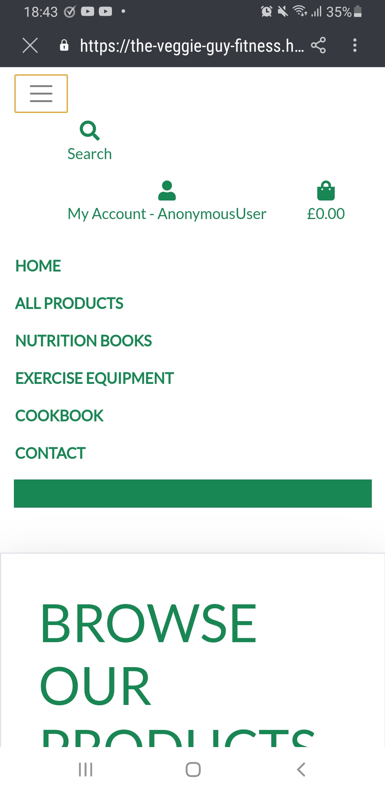
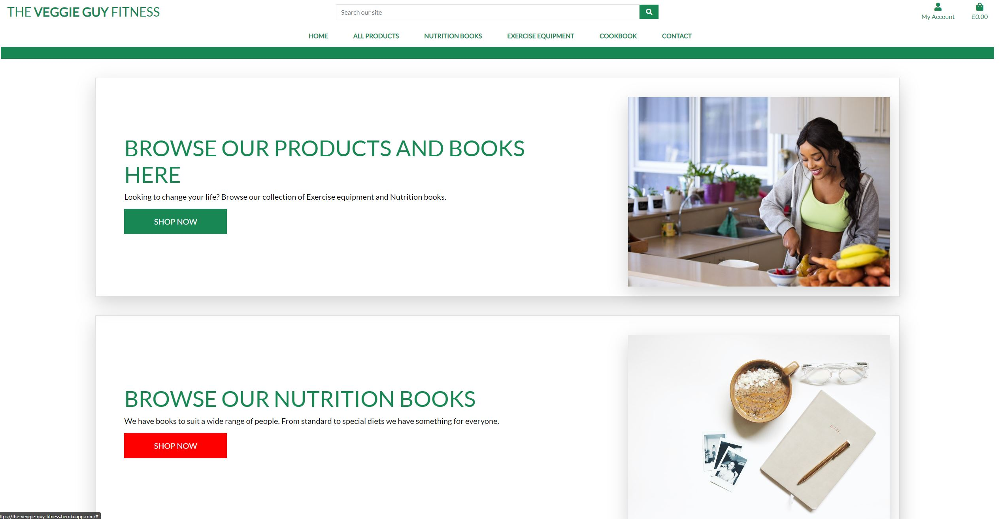

# The Veggie Guy Fitness App
# Testing

## Introduction

Full website testing can be seen below. For the main README cick <a href="https://github.com/Antony-Thornton/MS4--Fitness-Subscription-App/blob/main/README.md" target="_blank">here</a>. Full testing has been conducted AFTER the application was uploaded to Heroku.

 

# Table of Contents

-   [1. Testing](#testing)
    -   [1.1. Considerations](#considerations)
-   [2. Pre Herkou Checks](#refactor)
    -   [2.1 Code validation](#code)   
-   [3. Manual](#manual)

            

#### [Go To Top](#table-of-contents "Go To Top")

# 1. Testing

## 1.1 Considerations

* Testing has been based on a minimum size of an iPhone SE and a maximum width of 1440px as per my mentor’s advice. Custom CSS has been created to accommodate multiple screen sizes

* HTML code has been validated using <a href="https://validator.w3.org/" target="_blank">W3C Markup Validation Service</a>

* CSS code has been validated using <a href="https://jigsaw.w3.org/CSS-validator//" target="_blank">W3C CSS Validation Service</a>

* Javascript code has been validated using <a href="https://jshint.com/" target="_blank">JS Hint</a>

* Site response has been validated using <a href="http://ami.responsivedesign.is/" target="_blank">Am I Responsive</a>

* The website was sent to my partner and friend for general use/testing

### iPhone SE

### 1440p

# 2. Pre Herkou Checks

## PEP8 Online results

| App | .py file | Result
| :-- | :-- | :--
Cart | apps.py | Ok
 || context.py | Ok - Ignored commented text
 || urls.py | Ok
 || Views.py | Ok
Checkout | init.py | Ok
 || admin.py | Ok
 || apps.py | Ok
 ||forms.py | Ok
 || models.py | Ok
 || signals.py | Ok
 || urls.py | Ok
 || views.py | Ok
 || webhook_handler.py | Ok
 || webhooks.py | Ok
Contact | admin.py | Ok
|| apps.py | Ok
|| forms.py | Ok
|| models.py | Ok
|| urls.py | Ok
|| views.py | Ok
Main App | asgi.py | Ok
|| settings.py | Ok
|| urls.py | Ok
|| wsgi.py | Ok
Home | apps.py | Ok
|| models.py | Ok
|| urls.py | Ok
|| views.py | Ok
| Products | admin.py | Ok
|| apps.py | Ok
|| forms.py | Ok
|| models.py | Ok
|| urls.py | Ok
|| views.py | Ok
|| widgets.py | Ok
| Profiles | apps.py | Ok
|| forms.py | Ok
|| models.py | Ok
|| urls.py | Ok
|| views.py | Ok
| Manage.py | Manage.py | Ok

## Post Pep8 chenages testing
Running basic checks to see if everything is still working as expected.

| Page | What happened? | Fix
| :-- | :-- | :--
Add/edit items | Template Name variable in widgets.py was too long so I broke it onto the next line. This caused a pathing error when loading the pages. |  Need to confirm with mentor/community. Left as too long with a comment for the moment.
Links | n/a | n/a 
Review form | n/a | n/a 
Product details functions | n/a | n/a 
Cart Functions | n/a | n/a 
Secure Checkout Functions | n/a | n/a 
Add/edit functions | n/a | n/a 
My profile | n/a | n/a 

 
 

## 2.1 Code validation

## HTML Validator results

| Page | Date Checked | Result | Comment
| :--- | :--- | :--- | :-- 
Home Page | 05/06/2022 | Pass | Python errors
Contact | 05/06/2022 | Pass | 1 non python related error regarding required element. Because its a contact form I need a name and therfore required so the user has to enter something.
All products | 05/06/2022 | Pass | Python errors
All books | 05/06/2022 | Pass | Python errors
All Equipment | 05/06/2022 | Pass | Python errors
Product Management | 05/06/2022 | Pass | Python errors
My profile | 05/06/2022 | Pass | Python errors - Copy and pasted due to user login
Add product | 05/06/2022 | Tentitve Pass | HTML errors resulting from cripsy forms i believe. I could not find the code that wc3 was validating.
Edit product | 05/06/2022 | Tentitve Pass | HTML errors resulting from cripsy forms i believe. I could not find the code that wc3 was validating.

 

## CSS Validator results
| Page | Date Checked | Result | Comment
| :--- | :--- | :--- | :-- 
checkout.css | 05/06/2022 | Pass | n/a
profile.css | 05/06/2022 | Pass | n/a
base.css | 05/06/2022 | Pass | n/a

 

### JavaScript results
| Page | Date Checked | Result | Comment
| :--- | :--- | :--- | :-- 
countryfield.js  | 05/06/2022 | Pass | 1 warning (ES6)
stripe_elements.js  | 05/06/2022 | Pass | 2 Warnings (ES6)
cart.html postload | 05/06/2022 | Pass | 1 warning (ES6)
add_product.html postload | 05/06/2022 | Pass | 1 warning (ES6)
product_detail.html postload | 05/06/2022 | Pass | n/a
products.html postload | 05/06/2022 | Pass | 1 warning (ES6)
profile.html postload | 05/06/2022 | Pass | 1 warning (ES6)
base.html postload | 05/06/2022 | Pass | n/a

## Post Pep8 changes testing
Running basic checks to see if everything is still working as expected.

| Page | What happened? | Fix
| :-- | :-- | :--
Add/edit items | n/a | n/a
Links | n/a | n/a 
Review form | n/a | n/a 
Product details functions | n/a | n/a 
Cart Functions | n/a | n/a 
Secure Checkout Functions | n/a | n/a 
Add/edit functions | n/a | n/a 
My profile | n/a | n/a 

 

## Final Summary

Code and website running as expected as of 05/06/2022 20:21. Happy to add the products themselves (leaving test items) and upload to Heroku.
 
 

# 3. Post Heroku Manual Testing

## Navigation Bar
All Pages:

| Page | Expected result | Result Desktop | Result iPad | Result S9+ Phone 
| :--- | :--- | :--- | :--- | :---
Home | The link should navigate to the page noted | Pass | Pass | Pass
All products | The link should navigate to the page noted | Pass |  Pass | Pass
Nutrition Plans| The link should navigate to the page noted | Pass | Pass | Pass
Contact| The link should navigate to the page noted | Pass |  Pass | Pass
Product Management | The link should navigate to the page noted | Pass |  Pass | Pass
My Profile | The link should navigate to the page noted | Pass |  Pass | Pass
Log out | The link should navigate to the page noted | Pass |  Pass | Pass
Log in | The link should navigate to the page noted | Pass |  Pass | Pass
Register | The link should navigate to the page noted | Pass |  Pass | Pass
Edit product | The link should navigate to the page noted | Pass |  Pass | Pass

 
 

## Footer Links
All Pages:

| Page | Expected result | Result Desktop | Result iPad | Result S9+ Phone 
| :--- | :--- | :--- | :--- | :---
Home| The 4 links should open to the specified site | Pass |  Pass | Pass
All products | The 4 links should open to the specified site | Pass |  Pass | Pass
Nutrition Plans | The 4 links should open to the specified site | Pass |  Pass | Pass
Exercise Equipement| The 4 links should open to the specified site | Pass |  Pass | Pass
Contact| The 4 links should open to the specified site | Pass |  Pass | Pass
Product Management| The 4 links should open to the specified site | Pass |  Pass | Pass
My Profile| The 4 links should open to the specified site | Pass |  Pass | Pass
Log out| The 4 links should open to the specified site | Pass |  Pass | Pass
Register| The 4 links should open to the specified site | Pass |  Pass | Pass
Edit product| The 4 links should open to the specified site | Pass |  Pass | Pass

 
 

## Home Page
| Expected result | Outcome | Result Desktop | Result iPad | Result S9+ Phone 
| :--- | :--- | :--- | :--- | :---
Browse all products link should direct to all products page. | Pass | Pass |  Pass | Pass
Browse all nutrition books link should direct to all books page. | Initial fail. Forgot to add categories to url. Now a pass.| Pass |  Pass | Pass
Browse all Exercise Equipment link should direct to all equipment page. | Initial fail. Forgot to add categories to url. Now a pass.| Pass |  Pass | Pass

 
 

## All Products

| Expected result | Outcome | Result Desktop | Result iPad | Result S9+ Phone 
| :--- | :--- | :--- | :--- | :---
All products in admin should show correctly. This includes all associated expected text such as name, price and category. | Pass | Pass |  Pass | Pass
If the super user is logged in an edit and delete product should be visible. Both the links should work. | Pass | Pass |  Pass | Pass
If a super user is NOT logged in an edit and delete product should NOT be visible. | Pass | Pass |  Pass | Pass
Clicking on a catgory should filter all results for that category. | Pass | Pass |  Pass | Pass
Clicking on a picture should take the user to that product detail page. | Pass | Pass |  Pass | Pass
Each of the drop down links should filter or sort by whatever the user selects. | Pass | Pass |  Pass | Pass

 
 

## Nutrition Plans
| Expected result | Outcome | Result Desktop | Result iPad | Result S9+ Phone 
| :--- | :--- | :--- | :--- | :---
All products in admin should show correctly. This includes all associated expected text such as name, price and category.| Pass | Pass |  Pass | Pass
If the super user is logged in an edit and delete product should be visible. Both the links should work. | Pass | Pass |  Pass | Pass
If a super user is NOT logged in an edit and delete product should NOT be visible. | Pass | Pass |  Pass | Pass
Clicking on a catgory should filter all results for that category. | Pass | Pass |  Pass | Pass
Clicking on a picture should take the user to that product detail page.| Pass | Pass |  Pass | Pass
Each of the drop down links should filter or sort by whatever the user selects.| Pass | Pass |  Pass | Pass

 
 

## Exercise Plans
| Expected result | Outcome | Result Desktop | Result iPad | Result S9+ Phone 
| :--- | :--- | :--- | :--- | :---
All products in admin should show correctly. This includes all associated expected text such as name, price and category.| Pass | Pass |  Pass | Pass
If the super user is logged in an edit and delete product should be visible. Both the links should work. | Pass | Pass |  Pass | Pass
If a super user is NOT logged in an edit and delete product should NOT be visible. | Pass | Pass |  Pass | Pass
Clicking on a catgory should filter all results for that category. | Pass | Pass |  Pass | Pass
Clicking on a picture should take the user to that product detail page. | Pass | Pass |  Pass | Pass
Each of the drop down links should filter or sort by whatever the user selects. | Pass | Pass |  Pass | Pass

 
 

## Contact
| Expected result | Outcome | Result Desktop | Result iPad | Result S9+ Phone 
| :--- | :--- | :--- | :--- | :---
The user should be able to fill out a form including name, email and message. | Pass | Pass |  Pass | Pass
The form should not submit if any field is empty.| Pass | Pass |  Pass | Pass

 
 

## Product Details
| Expected result | Outcome | Result Desktop | Result iPad | Result S9+ Phone 
| :--- | :--- | :--- | :--- | :---
The page should load with; the image, the name, the price, the description and any reviews found in the database.| In some cases the image didnt always load. Usually an issue with added products. Suspect it's a file type/size issue as some additional pictures work and some dont. | Pass |  Pass | Pass
If the super user is logged in an edit and delete product should be visible. Both the links should work. | Pass | Pass |  Pass | Pass
If a super user is NOT logged in an edit and delete product should NOT be visible. | Pass | Pass |  Pass | Pass
The qauntity should not drop below zero | Pass | Pass |  Pass | Pass
The quantity buttons should adjust the total up and down | Pass | Pass |  Pass | Pass
The keep shopping button should take the user to the all products page | Pass | Pass |  Pass | Pass
The add to cart button should add the total quantity of items to the user cart.| Pass | Pass |  Pass | Pass
The user should be able to submit a review but NOT a blank review.| Pass | Pass |  Pass | Pass

 
 

## Shopping Cart
| Expected result | Outcome | Result Desktop | Result iPad | Result S9+ Phone 
| :--- | :--- | :--- | :--- | :---
If the cart is empty a cart should display with a keep shopping button. | Pass | Pass |  Pass | Pass
The keep shopping button should take the user to the products page.| Pass | Pass |  Pass | Pass
The cart should display the product information and quantity that the users selected.| Pass | Pass |  Pass | Pass
If the price is over £50 the delivery should be free. | Pass | Pass |  Pass | Pass
The subtotal button should not drop below zero and the plus above 99 when the qty is updated.| Pass | Pass |  Pass | Pass
The Qty should update to the left. | Pass | Pass |  Pass | Pass
Delete item should remove all of that item from the cart. | Pass | Pass |  Pass | Pass
The keep shopping button should take the user to the products page.| Pass | Pass |  Pass | Pass
The secure checkout button should take the user to the checkout page.| Pass | Pass |  Pass | Pass

 
 

## Checkout
| Expected result | Outcome | Result Desktop | Result iPad | Result S9+ Phone 
| :--- | :--- | :--- | :--- | :---
The contents of the shopping cart should display as an order summary in the checkout page. | Pass | Pass |  Pass | Pass
Each of the form fields should allow user input. | Pass | Pass |  Pass | Pass
The adjust cart button should take the user back to their cart.| Pass | Pass |  Pass | Pass
The complete order button should submit all of the details for payment and take the user to a checkout success page where the order information will be displayed. | Pass | Pass |  Pass | Pass

 
 

## Profile Page
| Page | Outcome | Result Desktop | Result iPad | Result S9+ Phone 
| :--- | :--- | :--- | :--- | :---
The profile page should display any order stored in the database for the current logged in user. | Pass | Pass |  Pass | Pass
The order number should take the user to their previously submitted order and have their details displayed.| Pass | Pass |  Pass | Pass
The User should be able to update their basic default delivery information and click the update information link.| Fail | Fail | Fail| Fail

 
 

## Search bar
| Expected result | Outcome | Result Desktop | Result iPad | Result S9+ Phone 
| :--- | :--- | :--- | :--- | :---
The search bard should display any products with text associated with a database item in a product page. | Pass | Pass | | Fail - Missing } - Now passing

 
 

## Product Management
| Expected result | Outcome | Result Desktop | Result iPad | Result S9+ Phone 
| :--- | :--- | :--- | :--- | :---
This page should allow a SUPER USER ONLY access to add a product. | Pass | Pass |  Pass | Pass
The form should error if a price over 6 digits is added. | Pass | Pass |  Pass | Pass
All of the categories should display from the database. | Pass | Pass |  Pass | Pass
A form with all data base items should be displayed for the user to add to the database. | Pass | Pass |  Pass | Pass
The user should be able to add an image. | Pass | Pass |  Pass | Pass

 
 

## Edit Product
| Expected result | Outcome | Result Desktop | Result iPad | Result S9+ Phone 
| :--- | :--- | :--- | :--- | :---
This page should allow a SUPER USER ONLY access to add a product. | Pass | Pass |  Pass | Pass
The form should display information about the item the user selected to edit. | Pass | Pass |  Pass | Pass
The form should error if a price over 6 digits is added. | Pass | Pass |  Pass | Pass
All of the categories should display from the database. | Pass | Pass |  Pass | Pass
A form with all data base items should be displayed for the user to change in the database.| Pass | Pass |  Pass | Pass
The user should be able to add an image. | Pass | Pass |  Pass | Pass

 
 

## Register
| Expected result | Outcome | Result Desktop | Result iPad | Result S9+ Phone 
| :--- | :--- | :--- | :--- | :---
The user should be displayed with a page allowing them to register. | Pass | Pass |  Pass | Pass

 
 

## Login Page
| Expected result | Outcome | Result Desktop | Result iPad | Result S9+ Phone 
| :--- | :--- | :--- | :--- | :---
The user should be displayed with a page allowing them to log in. | Pass | Pass |  Pass | Pass

 
 

## Logout Page
| Expected result | Outcome | Result Desktop | Result iPad | Result S9+ Phone 
| :--- | :--- | :--- | :--- | :---
The user should be displayed with a page allowing them to log out. | Pass | Pass |  Pass | Pass

 
 
